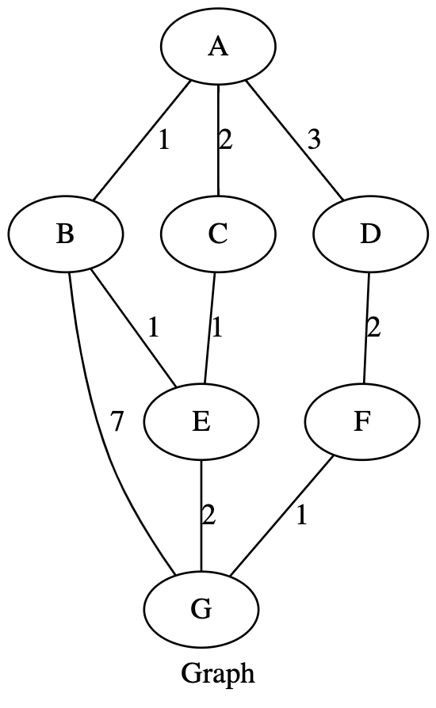
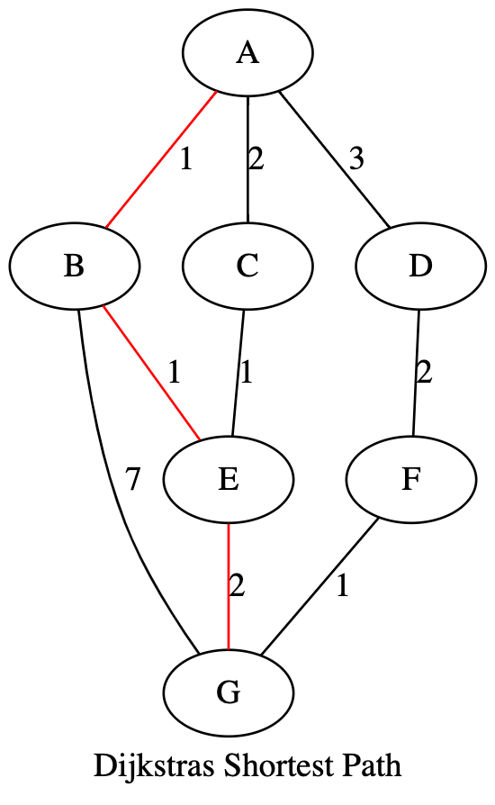
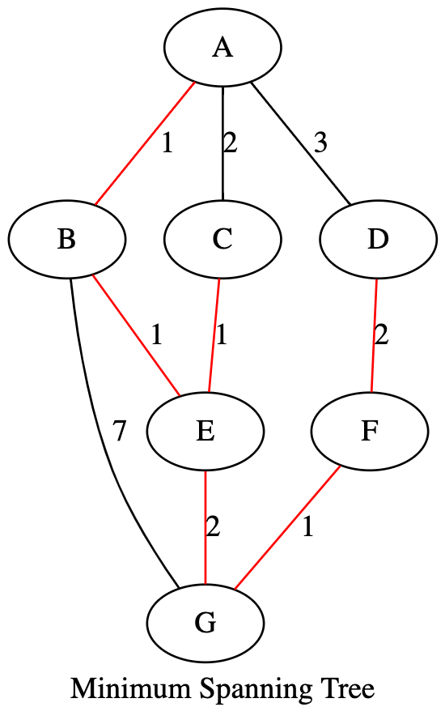

# Dijkstras & Prims MST On A Hand-Drawn Graph

*The purpose of this project is to take a hand drawn graph on scratch paper and use computer vision to interpret the various vertices, edges and associated weights*

## Sample Input

## Sample Output

### Outline

Module 1

* Image Reader

Module 2

* Get Vertex
         
* Get Edge + Weight
         
*  Get Connections

            
Module 3

* Prims

* MST

#### Steps To Run Current Code/Results

1. git clone https://github.com/williamswarren/Dijkstra_Prims_Hand_Drawn_Graph.git

2. cd Dijkstra_Prims_Hand_Drawn_Graph/research

3. source opencv-venv/bin/activate

4. cd scripts

5. python3 BFS_Nodes_With_Color.py > results.txt

6. cat results.txt

Try opening an editor of your choice and playing with the different input graph files found at Dijkstra_Prims_Hand_Drawn_Graph/graphviz_images --> Nodes_With_Color{1..7}.png (Currently #3 is not showing the correct results)

More to come! 
