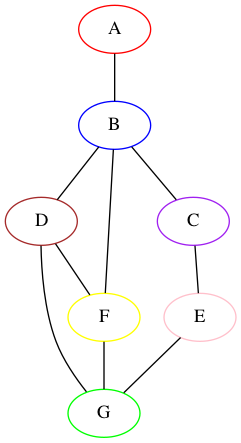

# Hand Drawn Graph Interpreter

*The purpose of this project is to take a hand drawn graph on scratch paper and use computer vision to interpret the various vertices and edges*

## Sample Input

## Sample Output

### Outline

GOOD TO KNOW

* Please only use graphs drawn on blank white paper
* For now only works on graph with a maximum of 7 nodes 

If run as a script, use Option 2 below

Otherwise import graph_manager and instantiate Graph_Manager, pass in file/image you want to work with (IMAGE MUST BE IN PNG FORMAT)

## Coming Soon To A Github Repo Near You...

Edge Weight Detector & Dijkstra's SP & Prims MST 

## Steps To Run Current Code/Results

### OPTION 1: 

GO TO THIS LINK TO TRY WEB VERSION -> 

### OPTION 2:

git clone https://github.com/williamswarren/GraphMonkey

cd GraphMonkey

python3 -m venv virtualenv

source virtualenv/bin/activate

pip3 install -r requirements.txt

cd main

python3 main.py 'PASS IN YOUR IMAGE HERE'

processed graphs will be in **output_images** directory

